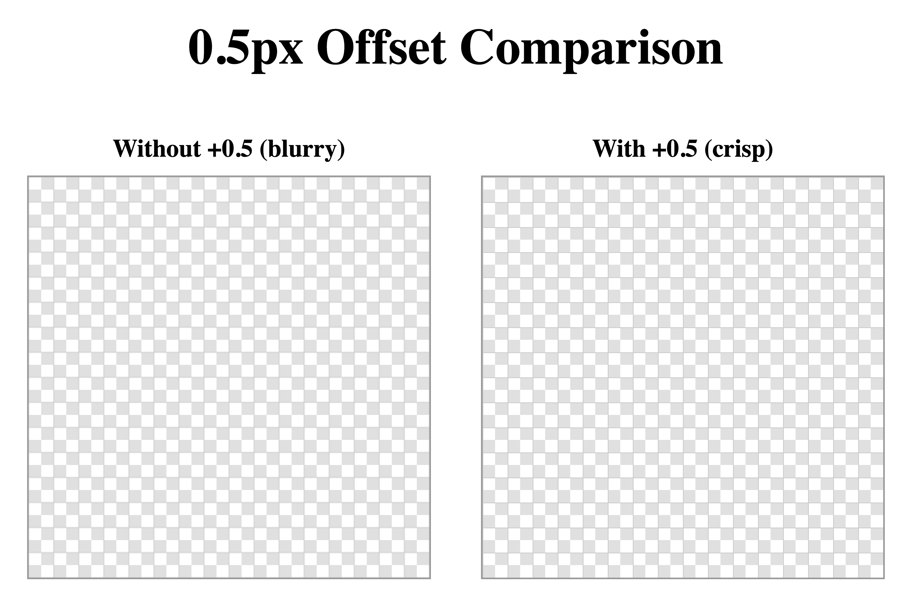

# Canvas2D 0.5px Offset for Crisp Lines

## Problem

Drawing a 1px line at integer coordinates in Canvas2D produces blurry results.



```typescript
// blurry
ctx.moveTo(10, 0);
ctx.lineTo(10, 100);
ctx.stroke(); // lineWidth = 1
```

## Why

Canvas2D uses a vector graphics coordinate system. Integer coordinates land on **pixel boundaries**, not pixel centers.

```
coords:  x=0       x=1       x=2
          |         |         |
      +---+---+---+---+---+---+---
      |       |       |       |
      | px 0  | px 1  | px 2  |
      |       |       |       |
      +---+---+---+---+---+---+---
```

`stroke` expands equally in both directions from the coordinate by `lineWidth`. With `lineWidth=1`, it extends 0.5px on each side.

```
lineWidth=1 at x=1:

  x=0.5     x=1     x=1.5
    |        |        |
    v        v        v
  +---------+---------+
  |  50%    |  50%    |
  |  alpha  |  alpha  |
  +---------+---------+
   pixel 0    pixel 1

-> Anti-aliased across two pixels = blurry 2px line
```

## Solution

Add 0.5 to align the stroke center with the pixel center.

```
lineWidth=1 at x=1.5:

  x=1      x=1.5     x=2
    |        |        |
    v        v        v
  +---------+---------+
  |  100%   |         |
  |  fill   |         |
  +---------+---------+
   pixel 1    pixel 2

-> Exactly 1 pixel filled at 100% = crisp 1px line
```

```typescript
// crisp
ctx.moveTo(10 + 0.5, 0);
ctx.lineTo(10 + 0.5, 100);
ctx.stroke();
```

## Alternatives

### `ctx.translate(0.5, 0.5)`

Shift the entire coordinate system once, then use integer coordinates for all strokes.

```typescript
ctx.translate(0.5, 0.5);
ctx.moveTo(10, 0);   // crisp without +0.5
ctx.lineTo(10, 100);
ctx.stroke();
```

However, this **misaligns all fill operations by 0.5px**. `fillRect(0, 0, 10, 10)` would start at `(0.5, 0.5)`. Not suitable when fill and stroke are mixed on the same canvas.

### Drawing lines with `fillRect`

Avoid stroke entirely by drawing 1px rectangles with fill.

```typescript
for (let x = 0; x <= canvasWidth; x++) {
    ctx.fillRect(x * pixelSize, 0, 1, displayHeight);
}
```

Fill aligns perfectly with boundary coordinates, so no correction is needed. However, it requires one `fillRect` call per line, compared to a single `beginPath` + `stroke` batch.

### This project's choice: per-coordinate `+ 0.5`

| Approach | Advantage | Issue in this project |
|---|---|---|
| `+ 0.5` | Precise control over fill/stroke separately | Only needed in the grid function |
| `translate(0.5, 0.5)` | Clean code | Misaligns fill-based rendering (checkerboard, pixels) |
| `fillRect` lines | No correction needed | More API calls, no lineWidth control |

This project mixes fill (checkerboard, pixel rendering) and stroke (grid) on the same canvas, so applying `+ 0.5` only in the grid rendering function has the fewest side effects.

## Scope

- **Only needed for odd lineWidth values.** With `lineWidth=2`, the stroke extends 1px on each side and aligns perfectly with integer coordinates.
- **Only applies to stroke APIs.** `fillRect` and other fill operations start at the coordinate and extend in one direction, so they never straddle pixel boundaries.

## Background: Why Canvas2D Uses Boundary Coordinates

Canvas2D adopted the same vector graphics coordinate model as SVG, PDF, and PostScript. In this system, the distance between coordinates equals the number of pixels, so `fillRect(0, 0, 2, 2)` fills exactly 2x2 pixels. If coordinates were at pixel centers, the same call would occupy 3x3 pixels, or the API would need internal corrections.

This design is **optimized for fill operations**. Since fill is far more common than stroke, this is a reasonable trade-off. However, in applications like pixel art editors where integer-aligned rendering matters, the 0.5px correction cost becomes visible.

## Reference

- [MDN: Applying styles and colors - A lineWidth example](https://developer.mozilla.org/en-US/docs/Web/API/Canvas_API/Tutorial/Applying_styles_and_colors#a_linewidth_example)
